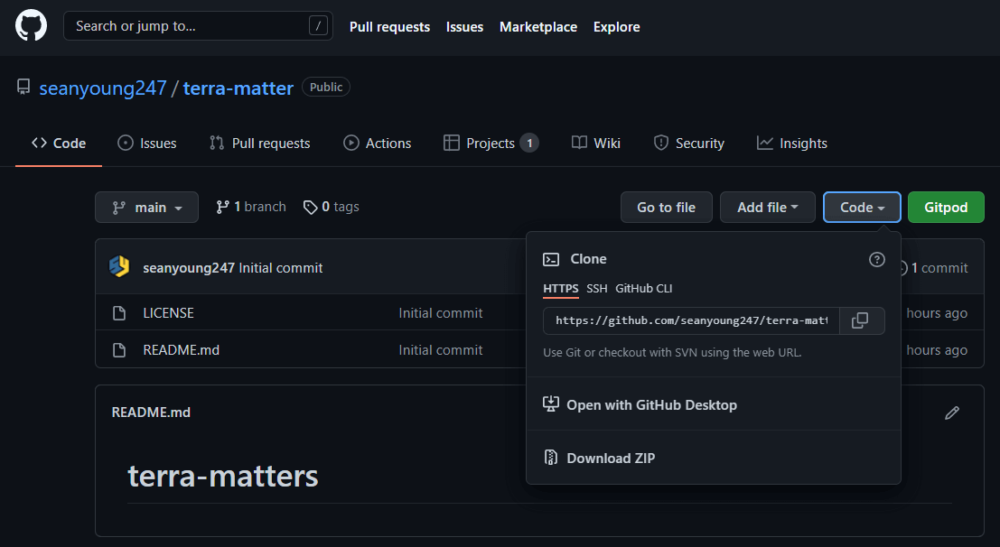
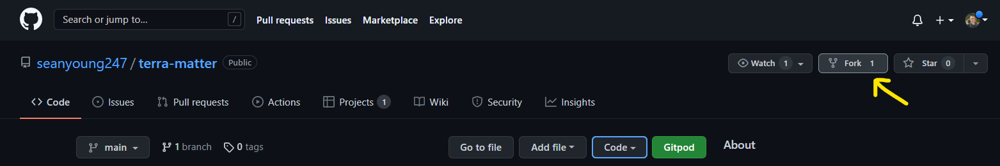

# **Terra Matter**


## Visit the live Website : **[Terra Matter :arrow_right:](https://seanyoung247.github.io/terra-matter/)**

**Terra Matter** is a learning web application that promotes curiosity and enjoyment in the process of acquiring knowledge about the impact of our daily routine on the environment.

This project is created in recognition of Earth day and our love and care of our home, the Planet Earth.

## Table of Content

* [Project]("#Project)
  * [Project Goals](#Project-Goals)
  * [Developer and Business Goals](#Developer-and-Business-Goals)
  * [User Goals](#User-Goals)
* [UX](#UX)
  * [Audience Definition](#Audience-Definition)
  * [User Stories](#User-Stories)
  * [Design Choices](#Design-Choices)
  * [Wireframes](#Wireframes)
  * [Different Design](#Different-Design)
* [Features](#Features)
  * [Existing Features](#Existing-Features)
  * [Features to Implement in the Future Versions](#Features-to-Implement-in-the-Future-Versions)
* [Technologies Used](#Technologies-Used)
* [Testing](#Testing)
* [Deployment](#Deployment)
  * [Live Deployment](#Live-Deployment)
  * [Local Deployment](#Local-Deployment)
* [Bugs](#Bugs)
  * [Solved](#Solved)
  * [Unsolved](#Unsolved)
* [Credits](#Credits)
  * [Content](#Content)
  * [Media](#Media)
  * [Acknowledgements](#Aknowledgements)
  
## Project

### Project Goals

* Terra Matter is an interactive web app created to bring knowledge to its user about the impact of our daily routine on the Earth.
* It promotes curiosity and enjoyment in the process of learning for building lasting interest.  
* It is and educational platform that makes learning fun.

### Developer and Business Goals

* Develop an interactive website using HTML, CSS and JavaScript.
* Bring knowledge to the Users.
* Make learning fun.
* Teach environmental awareness.
* Entertain.
* Impact a broad range of Users.
* Be considered for valid tool in schools and other institutions.

### User Goals

* Learn about the impact of our daily routine.
* Learn how to improve our routine to better environmental impact.
* Improve and have fun.

[**:back:** *Table of Content*](#Table-of-Content)

## UX

### **Audience Definition**

The targeted audience is international and adress everyone (from Earth and beyong!).

#### The targeted audience for this website is looking for :

* Learning.
* Improving their knowledge.
* Checking on some information.
* A challenge. (if quiz implemented)
* Having fun.

#### This website is the best way to answer their needs because :

* It provides information on the different daily tasks we take at home.
* It follows the best learning practice.
* It displays the content interactively.
* It gives an enjoyable learning experience.
* It proposes a game to test and reinforce knowledge. =============================> If implemented
* It rewards users by displaying achievements icons upon leaning new things.

[**:back:** *Table of Content*](#Table-of-Content)

### **User Stories**

**As a first time user, I want:**

1. The website to be appealing.
2. The navigation to be easy and intuitive.
3. The content to be informative but not overwhelming.
4. To understand immediately what is the website about without the need of looking for it.
5. The content to be interactive.

**As a returning user, I want:**

1. To improve my knowlede.
2. To keep my knowledge up to date.
3. To contact and get information on the website owner.

[**:back:** *Table of Content*](#Table-of-Content)

### **Design Choices**

#### Fonts

#### Icons

#### Logo

* The **logo** and **[favicon](assets/media/favicon/favicon.ico)** are the same image to follow best practice and consistency.


#### Colors


The colours chosen for the website are bright and joyful. They are based on the psychology behind colours ([colour affects](http://www.colour-affects.co.uk/psychological-properties-of-colours), [London Image Institute](https://londonimageinstitute.com/how-to-empower-yourself-with-color-psychology/)).

[Something here](URL) to create the colour scheme.

======================================================================================================== NEED TO BE CHECKED
The swatches are said to be color-blind safe by Adobe Color [accessibility tool](https://color.adobe.com/create/color-accessibility).


#### Images

#### Styling and Feeling

The website uses bright and simple colours to provide the feeling of easy accessibility.  
It presents a clean, playful, welcoming and trustworthy feel in order to bring quality information in a fun way!

[**:back:** *Table of Content*](#Table-of-Content)

### **Wireframes**


* [Site Map](assets/README-images/wireframes/site-map.pdf)
* [Home](assets/README-images/wireframes/home.pdf)
* [About](assets/wireframes/about.pdf)
* [Contact](assets/README-images/wireframes/contact.pdf)
* [404 error](assets/README-images/wireframes/404-error.pdf)

For the full version:

* [Terra Matter](assets/README-images/wireframes/terra-matter.pdf)

### **Different Design**

=============================================================== TBC
Some designs are different from the wireframes because of user experience compliance, accessibility and time.  

[**:back:** *Table of Content*](#Table-of-Content)

## Features

### Home


### About


### Contact

The contact page is very simple and offer users a way to reach out to the website owner.  
EmailJS has been implemented and allows the management of emails without needing the server side. It has been set to send an automatic email back to the user for better user experience.

There are four fields to fill up:

* Your name: → Who the person is.
* Email address: → To be answered back.
* Feedback or Question: → A textarea to provide additional information.
* A send button is displayed as well to send the form.  


Upon sending, a pop-up will give feedback to the user thanking him for the message. It will provide as well a link to the home and about pages in order to provide the main navigation links for better user experience.  
A similar feature will display if the form fail to send.

### 404 error

A custom page will handle the “404 error” by displaying a message explaining the error.  
It provides a button to go back to the home page and some useful links.

* A link that will bring the user to a website that explain what is a 404 error.
* A link that bring the user to the contact page to report an issue.


[**:back:** *Table of Content*](#Table-of-Content)

### **Features to Implement in the Future Versions**

# Technologies Used 

### Programing Languages

This project uses HTML, CSS and JavaScript.

 ===================================================================== TO Be UPDATED
### Frameworks, Libraries and Programs

* [Balsamiq](https://balsamiq.com/wireframes/)  
For creating wireframes.

* [Google Fonts](https://fonts.google.com/)  
For importing fonts (**Fredoka One**, **Handlee** and **Andika New Basic**) into the style.css file.

* [Font Awesome](https://fontawesome.com/icons?d=gallery)  
For using icons throughout the website.

* [Adobe Illustrator](https://www.adobe.com/ie/products/illustrator.html?mv=search&mv=search&sdid=KCJMVLF6&ef_id=Cj0KCQjw6pOTBhCTARIsAHF23fLEZr_7HRwIXxz-8HlXPJdeIFcn4mgqdShGl6MxV75SQB7gldl4qukaAoC3EALw_wcB:G:s&s_kwcid=AL!3085!3!520938456683!e!!g!!adobe%20illustrator!1426208079!56320331272&gclid=Cj0KCQjw6pOTBhCTARIsAHF23fLEZr_7HRwIXxz-8HlXPJdeIFcn4mgqdShGl6MxV75SQB7gldl4qukaAoC3EALw_wcB)  
For creating the logo and main site image content.

* [favicon.io](https://favicon.io/favicon-converter/)  
For generating the favicon.

* [TinyPNG](https://tinypng.com/) or [Squoosh](https://squoosh.app/)  
For resizing all the images.

* [BeFunky](https://www.befunky.com/create/)
For cropping some images.

* [Adobe Color](https://color.adobe.com/create/image)  
For extracting the color scheme used on the website.

* [Am I Responsive?](http://ami.responsivedesign.is/?url=http://ami.responsivedesign.is/#)  
For providing screenshots of the responsiveness of the website across several devices.

* [Autoprefixer CSS online](https://autoprefixer.github.io/)  
For adding prefixer in style.css for cross browser compatibility.

* [EmailJS](https://www.emailjs.com/)  
For email service implementation using API and without server.

* [Git](https://git-scm.com/)  
For Version control.

* [GitPod](https://www.gitpod.io/)  
For Integrated Development Environment.

* [GitHub](https://github.com/)  
For storing the repository.

* [GitHub Pages](https://pages.github.com/)  
For deploying the website live.

[**:back:** *Table of Content*](#Table-of-Content)


============================================================================ TO BE UPDATED
## Deployment

This project was developed on [GitPod Workspaces IDE](https://gitpod.io/workspaces/) (Integrated Development Environment) committed and pushed to my [GitHub Repository](https://github.com/seanyoung247/terra-matter) using GitPod Command Line Interface (CLI).

## Live Deployment

To make this website accessible to the public, Walking Around has been deployed on [GitHub Pages](https://pages.github.com/) as follow :

1. Log in to my GitHub account.
    * To create an account you need to sign up on [GitHub](https://github.com/).
2. Go to the [project repository](https://github.com/seanyoung247/terra-matter).
    * To create a repository see [Create a repo](https://docs.github.com/en/github/getting-started-with-github/create-a-repo).
3. Navigate to **Settings**.
4. Scroll down to the **GitHub Pages** section.
5. Click on the link to go to the dedicated tab :


6. Click on the **None** dropdown menu and select the branch to publish : **master**.


7. Click on **Save**.
8. The website is now deployed.

The link to the website is found in the **GitHub Pages** section of the repository settings.

[**:back:** *Table of Content*](#Table-of-Content)

## Local Deployment

### Cloning

When a repository is created on GitHub, it is located on GitHub website (“remotely”). You can create a copy of the repository locally on your machine. This process is called : “**Cloning a repository**”.  
When cloning a repository you are actually copying all the data that the repository contains at that time to your machine.

To clone a repository, take the following steps :

1. Create a GitHub account.
2. Click on the **Code** dropdown button above the files list.
3. There are three options available to clone the repository :
    * using HTTPS
    * using SSH key
    * using GitHub CLI  



4. Choose an option and copy the link given.
5. Change the current working directory to the location where you want the cloned directory.
6. Open your IDE and in the CLI type : ```git clone``` and paste the link copied on step 4.

>```$ git clone https://github.com/YOUR-USERNAME/YOUR-REPOSITORY```

7. Press **Enter** to create your local clone.

For further information please go to [Cloning a repository](https://docs.github.com/en/github/creating-cloning-and-archiving-repositories/cloning-a-repository#cloning-a-repository-using-the-command-line).

### Using GitPod

To Clone a repository Using GitPod, take the following steps :

1. Create a GitHub account.
2. Install the GitPod [extension](https://chrome.google.com/webstore/detail/gitpod-dev-environments-i/dodmmooeoklaejobgleioelladacbeki) for Chrome or [Add-on](https://addons.mozilla.org/en-GB/firefox/addon/gitpod/) for Firefox.
3. Navigate to the corresponding repository.
4. Click on the **GitPod** button on the top right of the files list.
5. This will open a workspace on GitPod where you can work on the repository locally.

>The very first time that you do this, you need to connect GitPod and GitHub together. You need to log in with GitHub and launch your workspace (As explain above). And then you need to authorize GitPod to be able to access your GitHub account. You agree to GitPod's terms and conditions, and then create a free account. Then, it will open the workspace for you.
Quote from : “Creating a GitPod Workspace” on [Code Institute Full Stack Software Development Programme](https://codeinstitute.net/full-stack-software-development-diploma/), by Matt Rudge.

### Using GitHub Desktop

Another option is available : GitHub Desktop. It consists of cloning a repository from GitHub to GitHub Desktop.  
For full information about how to use this option, please visit [GitHub Docs](https://docs.github.com/en/desktop/contributing-and-collaborating-using-github-desktop/cloning-a-repository-from-github-to-github-desktop).

### Forking

Forking a repository will copy it in your own repositories in GitHub.

>A fork is a personal copy of another user's repository that lives on your account. Forks allow you to freely make changes to a project without affecting the original upstream repository. You can also open a pull request in the upstream repository and keep your fork synced with the latest changes since both repositories are still connected.

To Fork a repository take the following steps :

1. Create a GitHub account.
2. Navigate to the corresponding repository.
3. Identify the ```fork``` button on the top right of the page and click on it.



4. Now you should find a copy of the repository in ```Your repositories```.

## Implementing API

[EmailJS](https://www.emailjs.com/) is used in this project in order to manage the contact form of the website.  
It is an API (Application Programming Interface), that allows emails management using JavaScript, without needing the server side.

To implement EmailJS take the following steps :

1. Create an account by [signing up](https://dashboard.emailjs.com/sign-up).
Free account are avaible and was used in this project limiting the number of email to 200 per month.
2. Go to [Email Services](https://dashboard.emailjs.com/admin) in order to link your email account.
3. Create a template or use the default proposed in [Email Templates](https://dashboard.emailjs.com/admin/templates).
4. Go to the [Docs → emailjs.send](https://www.emailjs.com/docs/sdk/send/) section in order to see how to implemnt the service. Different options are available.
5. In order to implement the service you will need your **user ID** and **Access Token** that refer to the **API keys**. You will find them in the [integration](https://dashboard.emailjs.com/admin/integration) section of your account.

:warning: **API keys** are private and sensitive information that should not be shared and kept private.

[**:back:** *Table of Content*](#Table-of-Content)

## Testing

Testing information are published in a separate file : [TESTING.md](TESTING.md)

## Bugs

### Solved

### Unsolved

[**:back:** *Table of Content*](#Table-of-Content)

## Credit

### Content :

[favicon.io](https://favicon.io/favicon-converter/)  
For converting the favicon and providing the links and explanation on how to install the favicon for the website.

### Media

Various source images were used to create the site content:
 - Television: [Mockup template vector created by MasoudRezaeipoor](https://www.freepik.com/vectors/mockup-template')
 - Lamps and lights: [Floor lamp vector created by pch.vector](https://www.freepik.com/vectors/floor-lamp')
 - Bathroom [Bathroom vector created by macrovector](https://www.freepik.com/vectors/bathroom')
 - Kitchen [Kitchen cupboard vector created by iconicbestiary](https://www.freepik.com/vectors/kitchen-cupboard)
 - Furniture [Clip art vector created by brgfx](https://www.freepik.com/vectors/clip-art)
 - Sofas [Couch vector created by pch.vector](https://www.freepik.com/vectors/couch)
 - Appliances [Household appliances vector created by macrovector](https://www.freepik.com/vectors/household-appliances)
 - Trees [Flat tree vector created by freepik](https://www.freepik.com/vectors/flat-tree)
 - Dishes [Dirty dishes vector created by macrovector](https://www.freepik.com/vectors/dirty-dishes)
 - Power plant [Shop house vector created by macrovector](https://www.freepik.com/vectors/shop-house)
 - Windmills [Green power vector created by brgfx](https://www.freepik.com/vectors/green-power)
 - Power Sockets and chargers [Set vector created by kubanek ](https://www.freepik.com/vectors/set)

##### External links :

[Wikipedia 404 error definition](https://en.wikipedia.org/wiki/HTTP_404)

##### Icons :

##### Images :

### Aknowledgements :

[**:back:** *Table of Content*](#Table-of-Content)
